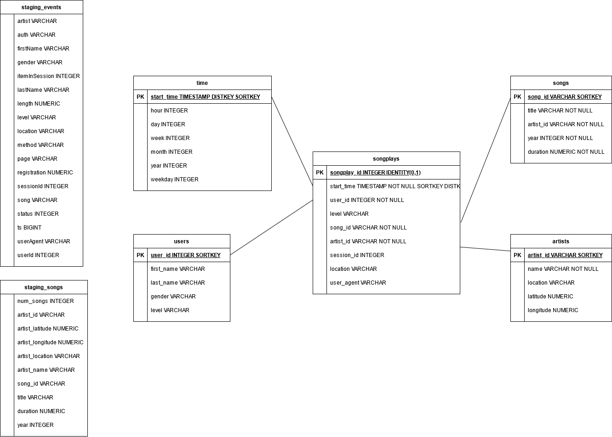

# Cloud Data Warehouse With AWS Redshift

## Summary

The demo project conducts ETL operations on JSON files from AWS S3 bucket and stores data in AWS Redshift.   
This README summarized the underlying project to collect and transfer the data into a star schema.

## Data
The data sets consists of two subsets of files:

- Song dataset (available at `s3://udacity-dend/song_data`) contains JSON files, like  

        {
        "num_songs": 1, 
        "artist_id": "AR8ZCNI1187B9A069B", 
        "artist_latitude": null, 
        "artist_longitude": null, 
        "artist_location": "", 
        "artist_name": "Planet P Project", 
        "song_id": "SOIAZJW12AB01853F1", 
        "title": "Pink World", 
        "duration": 269.81832, 
        "year": 1984
        }
  
- Log dataset (available at `s3://udacity-dend/log_data`) contains JSON files, like
  
        {
        "artist":"N.E.R.D. FEATURING MALICE",
        "auth":"Logged In",
        "firstName":"Jayden",				
        "gender":"M",						
        "itemInSession":0,
        "lastName":"Fox",					
        "length":288.9922,					
        "level":"free",							
        "location":"New Orleans-Metairie, LA",	
        "method":"PUT",				
        "page":"NextSong",
        "registration":1541033612796.0,
        "sessionId":184,
        "song":"Am I High (Feat. Malice)",		
        "status":200,
        "ts":1541121934796,						
        "userAgent":"\"Mozilla\/5.0 (Windows NT 6.3; WOW64) AppleWebKit\/537.36 (KHTML, like Gecko) Chrome\/36.0.1985.143 Safari\/537.36\"", '-> user_table
        "userId":"101" 
        }

## Data Models

For staging, first data model ingests event and song data from S3 in the tables "staging_events" and "staging_songs". 
The second data models represents a star schema with table "songplays" and "artist", "songs", "time", and "users" as dimensional tables.
The following diagram shows the tables, and corresponding fields and attributes.

## Prerequisites

The project requires a *Python* environment having the packages (see requirements.txt):  
> pandas,  
> pyscopg2,  

and a *Redshift cluster*. The configuration to access the cluster is contained in the config-file dwh.cfg in sections CLUSTER and IAM_Role. Use dwh_example.cfg as template.
The mandatory arguments are:

    [CLUSTER]  
    HOST=<Host to Redshift instance without PORT or Name of database>  
    DB_NAME=< Name of database in Redshift>  
    DB_USER=<name of administrator user>  
    DB_PASSWORD=<password for user>  
    DB_PORT=5439  

    [IAM_ROLE]  
    ARN=<IAM role that Redshift uses to access data on S3>   

## Getting Started
A running Python environment is assumed.  
First, connect to the S3 and load data into staging tables with Redshift environment:  

    python create_tables.py  

Second, execute the ETL operations and load the data into the final tables represent the star schema:  

    python etl.py

Finally, validate the imported data, e.g. using Amazon Queries Editor and execute `select count(*) from songplays`. That queries should return 333 rows. 

